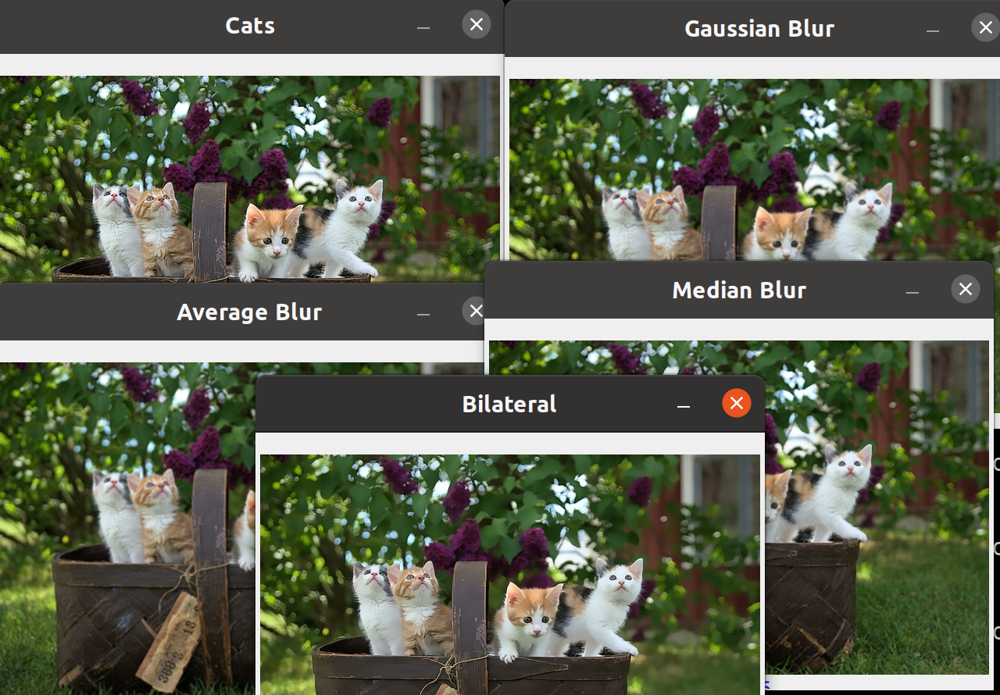
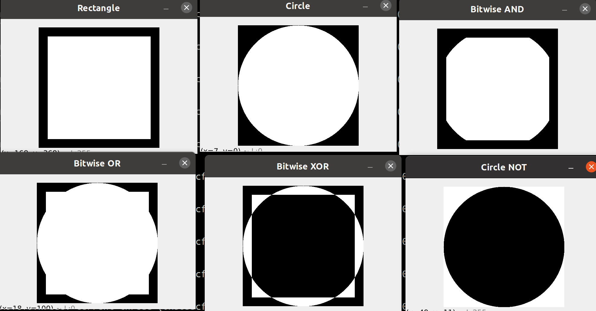
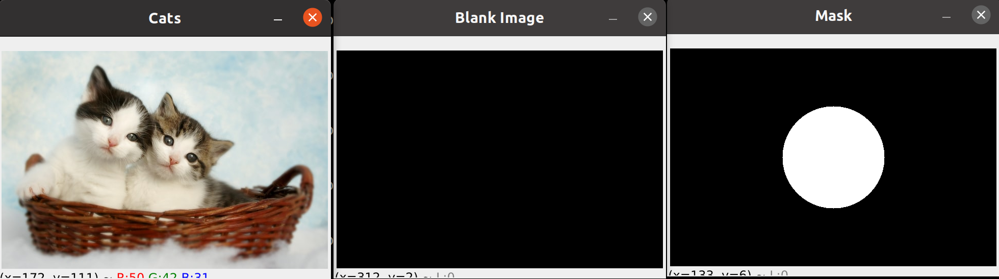
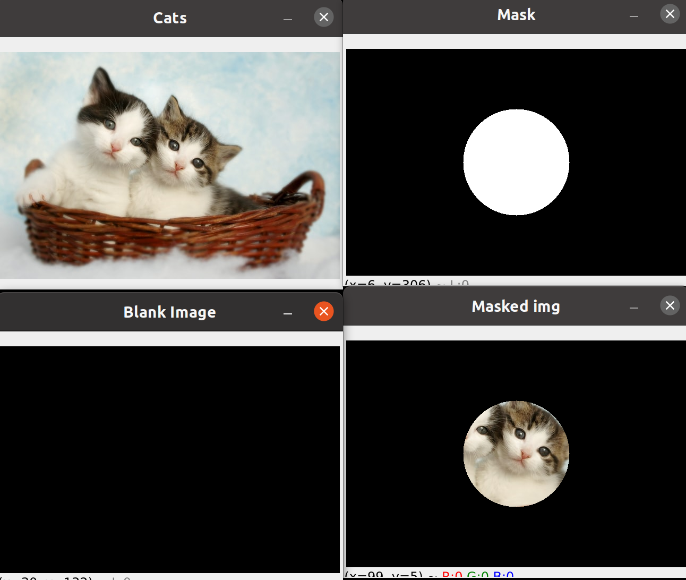
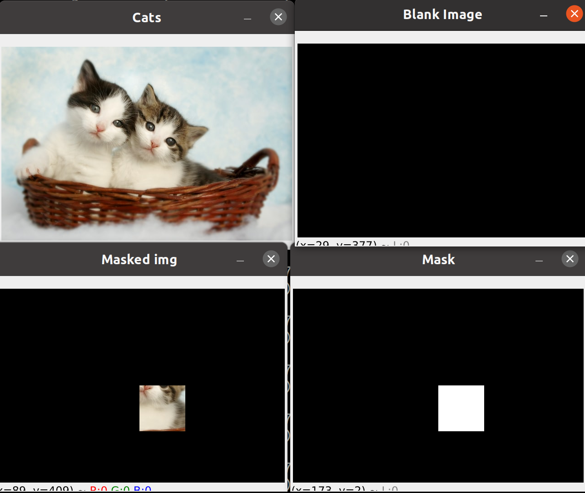

# 2º Advanced

# Color channels
1. [Dividir y unir en colores primarios ](#schema1)
2. [Canales de color](#scema2)
# Blurring
3. [Blurring](#schema3)
# Bitwase
4. [Bitwase](#schema4)

# 1. Dividir y unir en colores primarios
~~~python
b,g,r = cv.split(img)
cv.imshow("Blue", b)
cv.imshow("Red", r)
cv.imshow("Green", g)
~~~

~~~python
merged = cv.merge([b,g,r])
cv.imshow("Merged", merged)
~~~

# 2. Canales de color
~~~python
blank = np.zeros(img.shape[:2], dtype = "uint8")
blue = cv.merge([b, blank,blank])
green = cv.merge([blank,g,blank])
red = cv.merge([blank,blank,r])

~~~

# 3 Blurring

~~~python
# Averaging
average = cv.blur(img, (3,3))
cv.imshow('Average Blur', average)

# Gaussian Blur
gauss = cv.GaussianBlur(img, (3,3), 0)
cv.imshow('Gaussian Blur', gauss)

# Median Blur
median = cv.medianBlur(img, 3)
cv.imshow('Median Blur', median)

# Bilateral
bilateral = cv.bilateralFilter(img, 10, 35, 25)
cv.imshow('Bilateral', bilateral)
~~~

# 4 Bitwase

~~~python
blank = np.zeros((400,400), dtype='uint8')

rectangle = cv.rectangle(blank.copy(), (30,30), (370,370), 255, -1)
circle = cv.circle(blank.copy(), (200,200), 200, 255, -1)

cv.imshow('Rectangle', rectangle)
cv.imshow('Circle', circle)

# bitwise AND --> intersecting regions
bitwise_and = cv.bitwise_and(rectangle, circle)
cv.imshow('Bitwise AND', bitwise_and)

# bitwise OR --> non-intersecting and intersecting regions
bitwise_or = cv.bitwise_or(rectangle, circle)
cv.imshow('Bitwise OR', bitwise_or)

# bitwise XOR --> non-intersecting regions
bitwise_xor = cv.bitwise_xor(rectangle, circle)
cv.imshow('Bitwise XOR', bitwise_xor)

# bitwise NOT
bitwise_not = cv.bitwise_not(circle)
cv.imshow('Circle NOT', bitwise_not)
~~~

# 4. Masking

~~~python
blank = np.zeros((img.shape[0],img.shape[1]), dtype='uint8')
cv.imshow('Blank Image', blank)

mask = cv.circle(blank,(img.shape[1]//2,img.shape[0]//2), 100, 255, -1)
cv.imshow("Mask", mask)
~~~

~~~python
masked = cv.bitwise_and(img, img, mask = mask)
cv.imshow("Masked img", masked)
~~~

~~~python
mask_rect = cv.rectangle(blank,(img.shape[1]//2,img.shape[0]//2),(img.shape[1]//2 + 100,img.shape[0]//2+100), 255, -1)
cv.imshow("Mask", mask_rect)
masked = cv.bitwise_and(img, img, mask = mask_rect)
cv.imshow("Masked img", masked)
~~~
