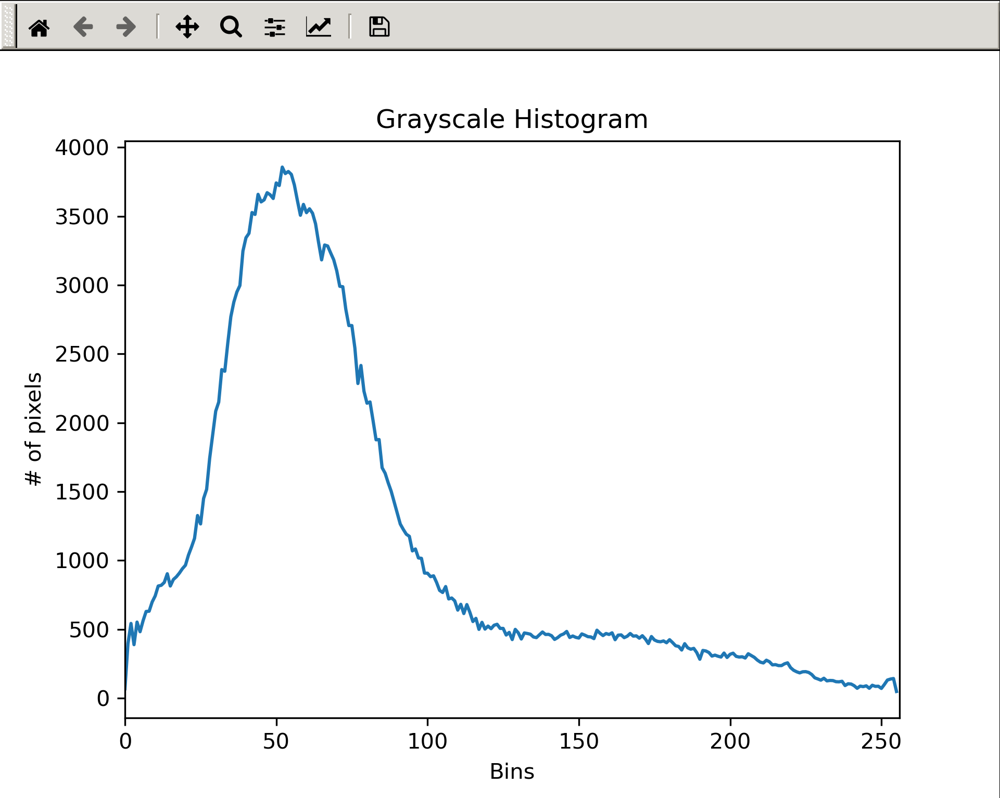
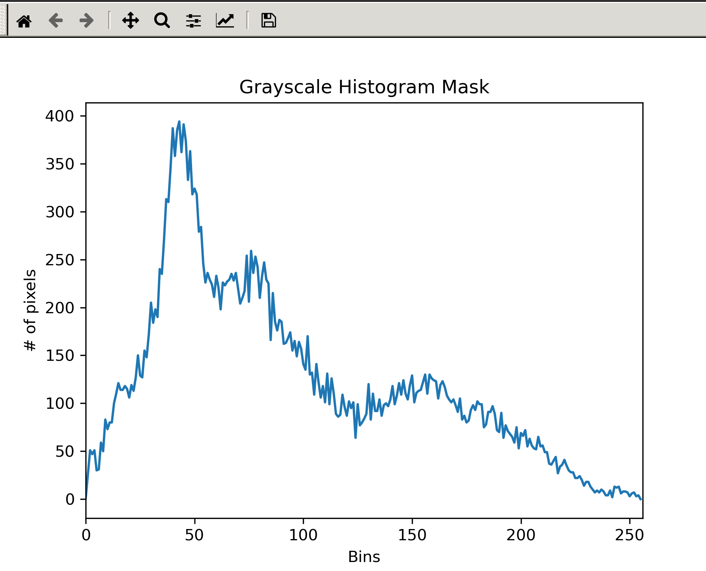
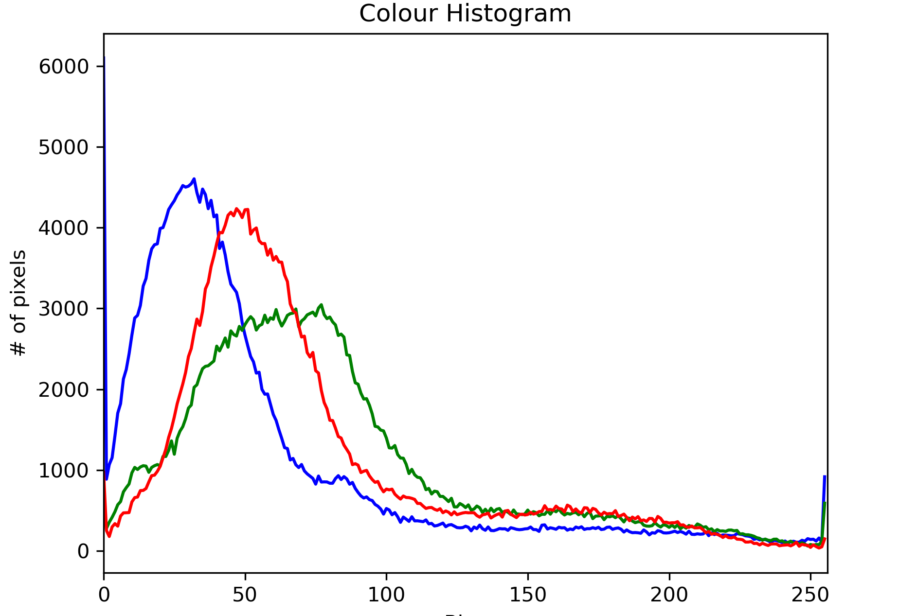
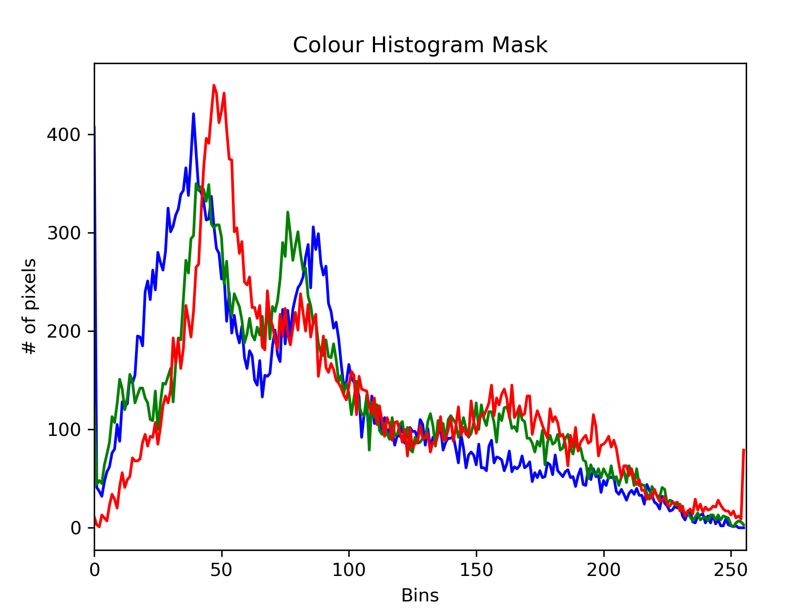
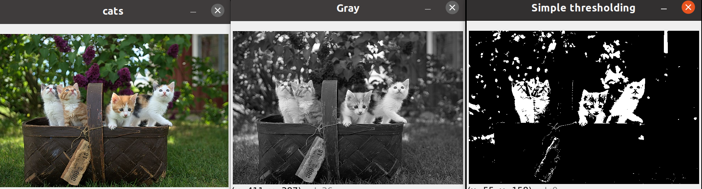
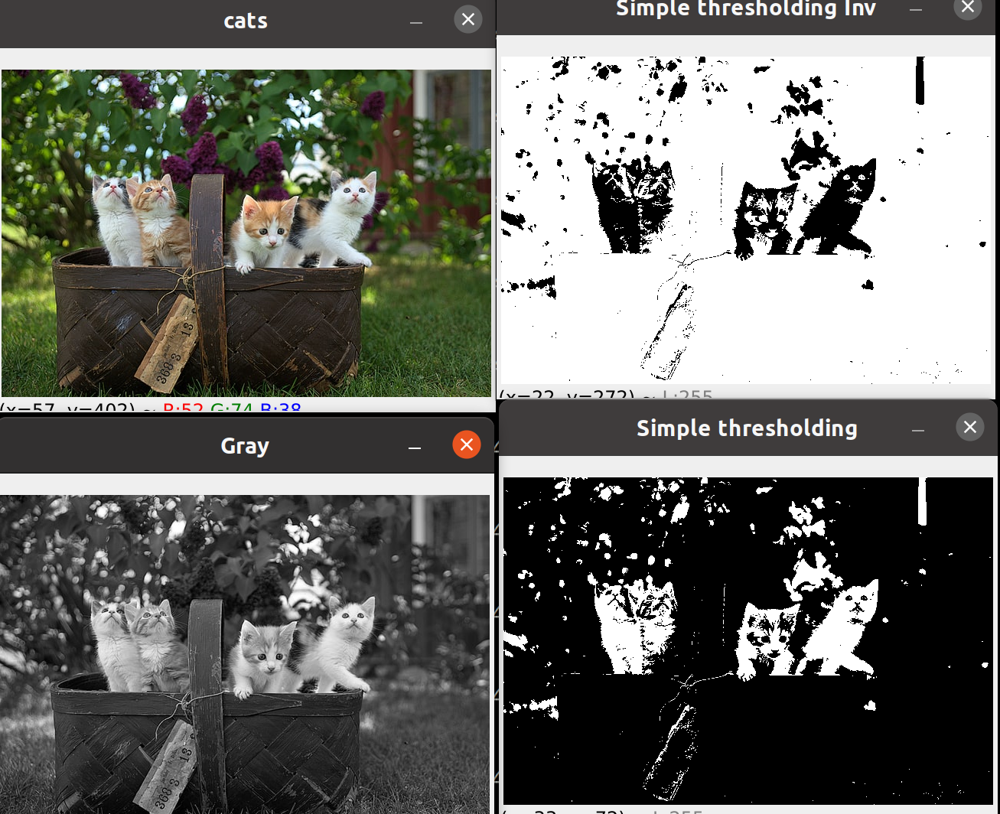
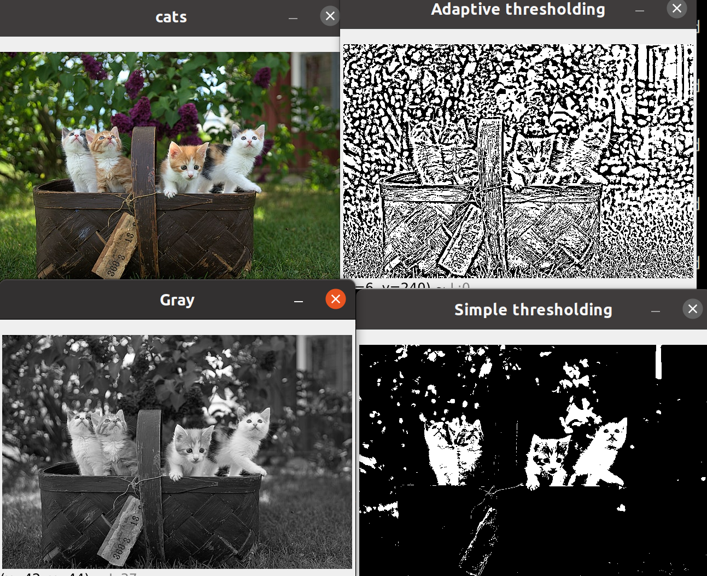

# 2º Advanced

1. [Dividir y unir en colores primarios ](#schema1)
2. [Canales de color](#schema2)
3. [Blurring](#schema3)
4. [Bitwase](#schema4)
5. [Masking](#schema5)
6. [Histogram Computation](#schema6)
7. [Thresholding/Binarizing Images](#schema7)

# 1. Dividir y unir en colores primarios
~~~python
b,g,r = cv.split(img)
cv.imshow("Blue", b)
cv.imshow("Red", r)
cv.imshow("Green", g)
~~~

~~~python
merged = cv.merge([b,g,r])
cv.imshow("Merged", merged)
~~~

# 2. Canales de color
~~~python
blank = np.zeros(img.shape[:2], dtype = "uint8")
blue = cv.merge([b, blank,blank])
green = cv.merge([blank,g,blank])
red = cv.merge([blank,blank,r])

~~~

# 3 Blurring

~~~python
# Averaging
average = cv.blur(img, (3,3))
cv.imshow('Average Blur', average)

# Gaussian Blur
gauss = cv.GaussianBlur(img, (3,3), 0)
cv.imshow('Gaussian Blur', gauss)

# Median Blur
median = cv.medianBlur(img, 3)
cv.imshow('Median Blur', median)

# Bilateral
bilateral = cv.bilateralFilter(img, 10, 35, 25)
cv.imshow('Bilateral', bilateral)
~~~

# 4 Bitwase

~~~python
blank = np.zeros((400,400), dtype='uint8')

rectangle = cv.rectangle(blank.copy(), (30,30), (370,370), 255, -1)
circle = cv.circle(blank.copy(), (200,200), 200, 255, -1)

cv.imshow('Rectangle', rectangle)
cv.imshow('Circle', circle)

# bitwise AND --> intersecting regions
bitwise_and = cv.bitwise_and(rectangle, circle)
cv.imshow('Bitwise AND', bitwise_and)

# bitwise OR --> non-intersecting and intersecting regions
bitwise_or = cv.bitwise_or(rectangle, circle)
cv.imshow('Bitwise OR', bitwise_or)

# bitwise XOR --> non-intersecting regions
bitwise_xor = cv.bitwise_xor(rectangle, circle)
cv.imshow('Bitwise XOR', bitwise_xor)

# bitwise NOT
bitwise_not = cv.bitwise_not(circle)
cv.imshow('Circle NOT', bitwise_not)
~~~

# 5. Masking

~~~python
blank = np.zeros((img.shape[0],img.shape[1]), dtype='uint8')
cv.imshow('Blank Image', blank)

mask = cv.circle(blank,(img.shape[1]//2,img.shape[0]//2), 100, 255, -1)
cv.imshow("Mask", mask)
~~~

~~~python
masked = cv.bitwise_and(img, img, mask = mask)
cv.imshow("Masked img", masked)
~~~

~~~python
mask_rect = cv.rectangle(blank,(img.shape[1]//2,img.shape[0]//2),(img.shape[1]//2 + 100,img.shape[0]//2+100), 255, -1)
cv.imshow("Mask", mask_rect)
masked = cv.bitwise_and(img, img, mask = mask_rect)
cv.imshow("Masked img", masked)
~~~

# 6. Histogram 

~~~python
gray = cv.cvtColor(img, cv.COLOR_BGR2GRAY)
cv.imshow("Gray", gray)
# Grayscale histogram
gray_hist = cv.calcHist([gray], [0], None, [256], [0,256] )

plt.figure()
plt.title('Grayscale Histogram')
plt.xlabel('Bins')
plt.ylabel('# of pixels')
plt.plot(gray_hist)
plt.xlim([0,256])
plt.show()
~~~

Con mask
~~~python
blank = np.zeros(img.shape[:2], dtype='uint8')

mask = cv.circle(blank, (img.shape[1]//2,img.shape[0]//2), 100, 255, -1)
masked = cv.bitwise_and(gray,gray,mask=mask)
cv.imshow('Mask', masked)

gray_hist = cv.calcHist([gray], [0], mask, [256], [0,256] )
plt.figure()
plt.title('Grayscale Histogram Mask')
plt.xlabel('Bins')
plt.ylabel('# of pixels')
plt.plot(gray_hist)
plt.xlim([0,256])
plt.show()
~~~

Colour Histogram
~~~python
plt.figure()
plt.title('Colour Histogram')
plt.xlabel('Bins')
plt.ylabel('# of pixels')
colors = ('b', 'g', 'r')
for i,col in enumerate(colors):
    hist = cv.calcHist([img], [i], None, [256], [0,256])
    plt.plot(hist, color=col)
    plt.xlim([0,256])

plt.show()
~~~

Colour Histogram mask
~~~python
plt.figure()
plt.title('Colour Histogram')
plt.xlabel('Bins')
plt.ylabel('# of pixels')
colors = ('b', 'g', 'r')
for i,col in enumerate(colors):
    hist = cv.calcHist([img], [i], Mask, [256], [0,256])
    plt.plot(hist, color=col)
    plt.xlim([0,256])

plt.show()
~~~

# 7. Thresholding/Binarizing Images

Simple thresholding
~~~python
img = cv.imread('./photos/cats.jpg')
cv.imshow('cats', img)

gray = cv.cvtColor(img, cv.COLOR_BGR2GRAY)
cv.imshow('Gray', gray)

threshold, thresh = cv.threshold(gray, 150, 255, cv.THRESH_BINARY)
cv.imshow("Simple thresholding", thresh)
~~~

Simple thresholding inv
~~~python
threshold, thresh_inv = cv.threshold(gray, 150, 255, cv.THRESH_BINARY_INV)
cv.imshow("Simple thresholding Inv", thresh_inv)
~~~

Adaptive Thersholding
~~~python
adaptive_thresh = cv.adaptiveThreshold(gray, 255, cv.ADAPTIVE_THRESH_MEAN_C,cv.THRESH_BINARY,11,3)
cv.imshow("Adaptive thresholding", adaptive_thresh)
~~~
