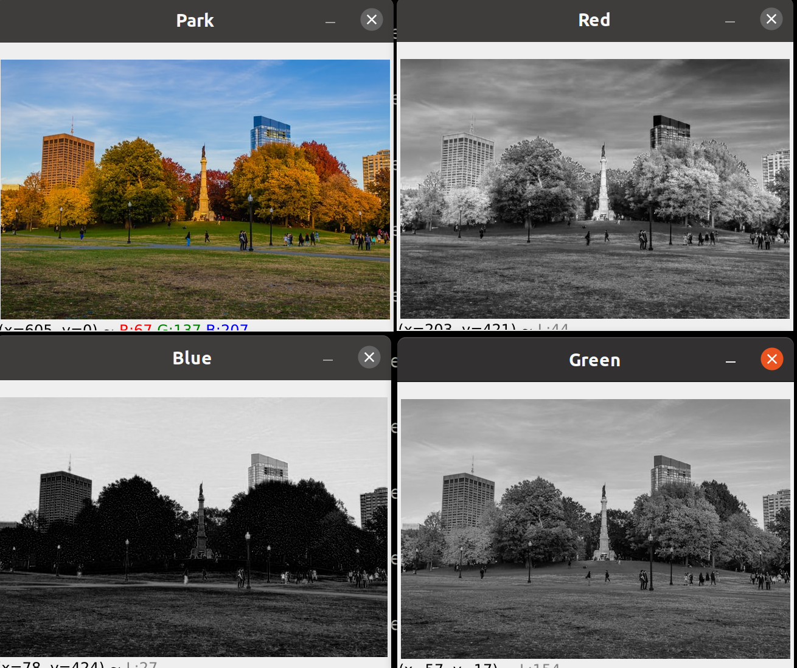
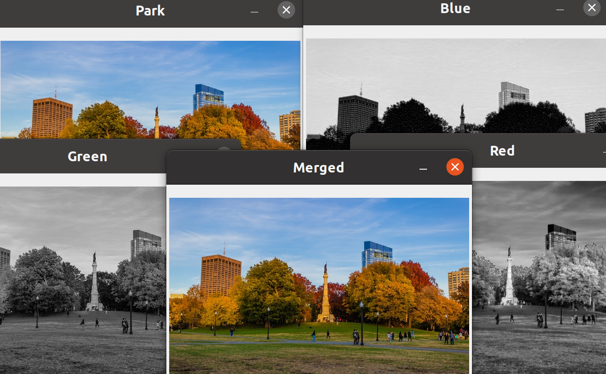
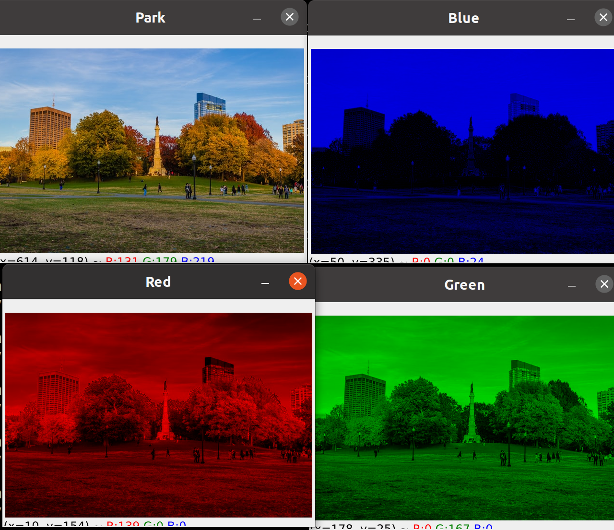

# 2º Advanced

# Color channels
1. [Dividir y unir en colores primarios ](#schema1)

# 1. Dividir y unir en colores primarios
~~~python
b,g,r = cv.split(img)
cv.imshow("Blue", b)
cv.imshow("Red", r)
cv.imshow("Green", g)
~~~

~~~python
merged = cv.merge([b,g,r])
cv.imshow("Merged", merged)
~~~

# 2 . Canales de color
~~~python
blank = np.zeros(img.shape[:2], dtype = "uint8")
blue = cv.merge([b, blank,blank])
green = cv.merge([blank,g,blank])
red = cv.merge([blank,blank,r])

~~~

